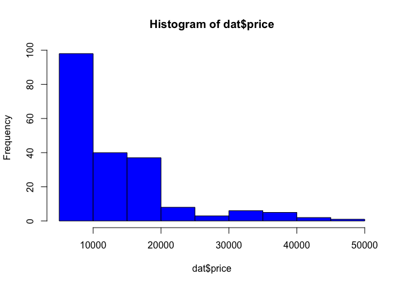
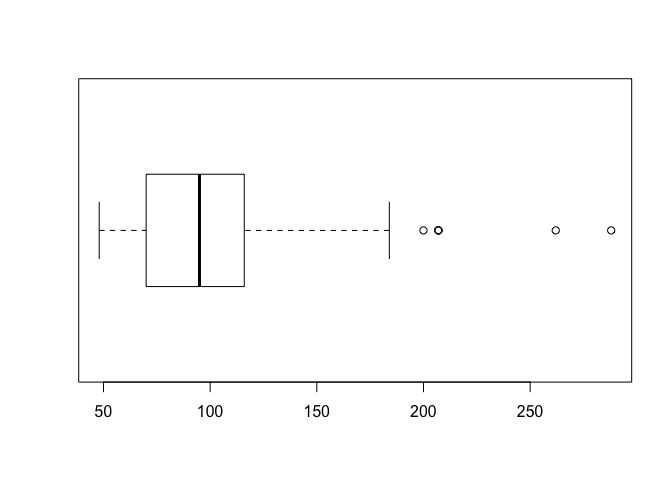
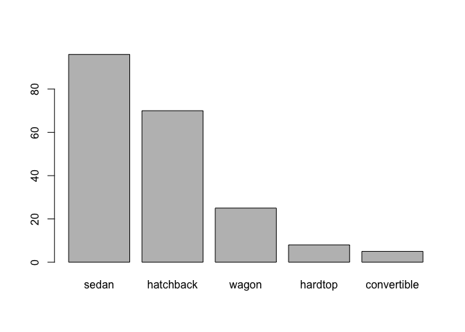
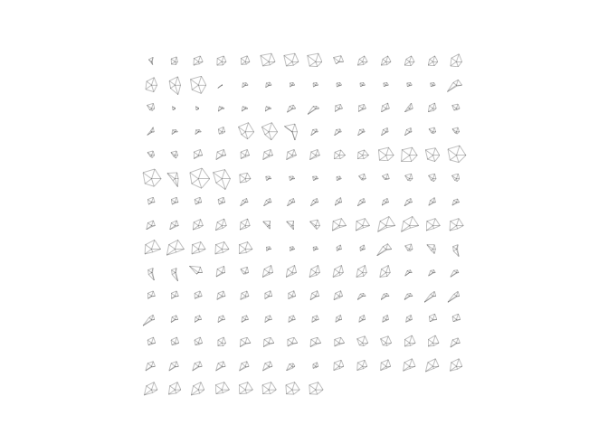
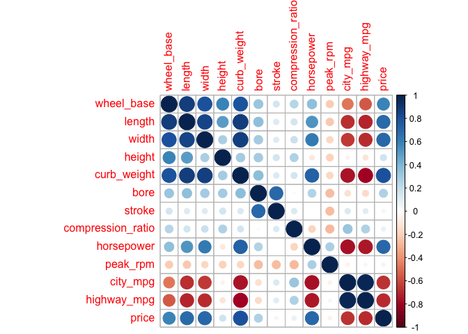
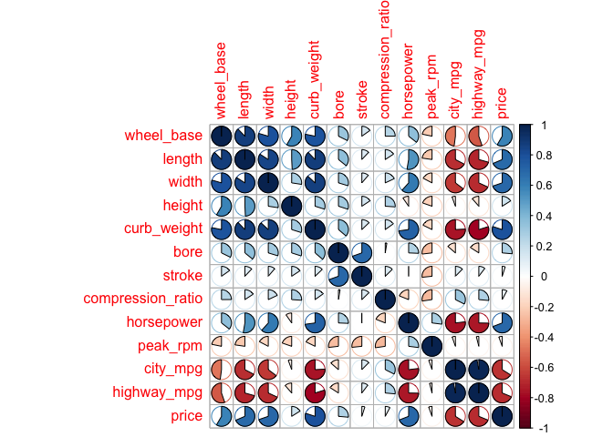
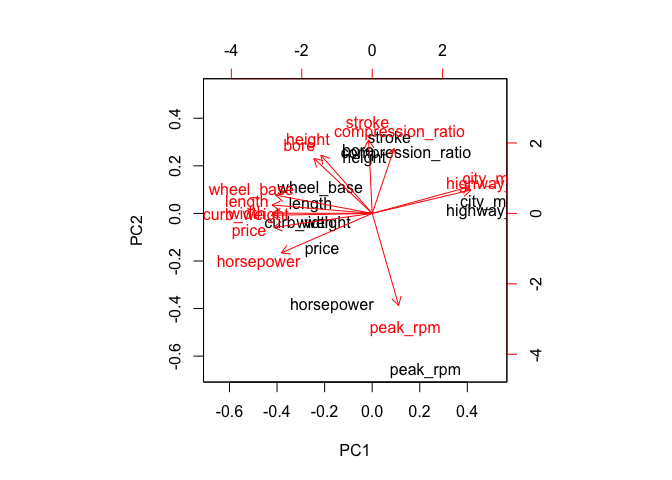

Untitled
================

Data Import
-----------

``` r
#install.packages("readr")
library(readr)
#install.packages("corrplot")
library(corrplot)
```

    ## corrplot 0.84 loaded

``` r
colnames <- c("symboling", "normalized_losses", "make", "fuel_type", "aspiration", "num_of_doors", "body_style", "drive_wheels", "engine_location", "wheel_base", "length", "width", "height", "curb_weight", "engine_type", "num_of_cylinders", "engine_size", "fuel_system", "bore", "stroke", "compression_ratio", "horsepower", "peak_rpm", "city_mpg", "highway_mpg", "price")

ctype <- c("real", "double", "character", "character", "character", "character", "character", "character", "character", "double", "double", "double", "double", "integer", "character", "character", "integer", "character", "double", "double", "double", "integer", "integer", "integer", "integer", "integer")

ctype2 <- c(symboling = col_double(), normalized_losses = col_double(), make = col_character(), fuel_type = col_character(), aspiration = col_character(), num_of_doors = col_character(), body_style = col_character(), drive_wheels = col_character(), engine_location = col_character(), wheel_base = col_character(), length = col_double(), width = col_double(), height = col_double(), curb_weight = col_integer(), engine_type = col_character(), num_of_cylinders = col_character(), engine_size = col_integer(), fuel_system = col_character(), bore = col_double(), stroke = col_double(), compression_ratio = col_double(), horsepower = col_integer(), peak_rpm = col_integer(), city_mpg = col_integer(), highway_mpg = col_integer(), price = col_integer())


dat <- read.csv(file = "imports-85.data", na.strings = "?", skipNul = TRUE, col.names = colnames, colClasses = ctype, sep = ",", stringsAsFactors = FALSE)
str(dat)
```

    ## 'data.frame':    204 obs. of  26 variables:
    ##  $ symboling        : num  3 1 2 2 2 1 1 1 0 2 ...
    ##  $ normalized_losses: num  NA NA 164 164 NA 158 NA 158 NA 192 ...
    ##  $ make             : chr  "alfa-romero" "alfa-romero" "audi" "audi" ...
    ##  $ fuel_type        : chr  "gas" "gas" "gas" "gas" ...
    ##  $ aspiration       : chr  "std" "std" "std" "std" ...
    ##  $ num_of_doors     : chr  "two" "two" "four" "four" ...
    ##  $ body_style       : chr  "convertible" "hatchback" "sedan" "sedan" ...
    ##  $ drive_wheels     : chr  "rwd" "rwd" "fwd" "4wd" ...
    ##  $ engine_location  : chr  "front" "front" "front" "front" ...
    ##  $ wheel_base       : num  88.6 94.5 99.8 99.4 99.8 ...
    ##  $ length           : num  169 171 177 177 177 ...
    ##  $ width            : num  64.1 65.5 66.2 66.4 66.3 71.4 71.4 71.4 67.9 64.8 ...
    ##  $ height           : num  48.8 52.4 54.3 54.3 53.1 55.7 55.7 55.9 52 54.3 ...
    ##  $ curb_weight      : int  2548 2823 2337 2824 2507 2844 2954 3086 3053 2395 ...
    ##  $ engine_type      : chr  "dohc" "ohcv" "ohc" "ohc" ...
    ##  $ num_of_cylinders : chr  "four" "six" "four" "five" ...
    ##  $ engine_size      : int  130 152 109 136 136 136 136 131 131 108 ...
    ##  $ fuel_system      : chr  "mpfi" "mpfi" "mpfi" "mpfi" ...
    ##  $ bore             : num  3.47 2.68 3.19 3.19 3.19 3.19 3.19 3.13 3.13 3.5 ...
    ##  $ stroke           : num  2.68 3.47 3.4 3.4 3.4 3.4 3.4 3.4 3.4 2.8 ...
    ##  $ compression_ratio: num  9 9 10 8 8.5 8.5 8.5 8.3 7 8.8 ...
    ##  $ horsepower       : int  111 154 102 115 110 110 110 140 160 101 ...
    ##  $ peak_rpm         : int  5000 5000 5500 5500 5500 5500 5500 5500 5500 5800 ...
    ##  $ city_mpg         : int  21 19 24 18 19 19 19 17 16 23 ...
    ##  $ highway_mpg      : int  27 26 30 22 25 25 25 20 22 29 ...
    ##  $ price            : int  16500 16500 13950 17450 15250 17710 18920 23875 NA 16430 ...

``` r
dat2 <- read_csv(file = "imports-85.data", col_names = colnames, col_types = ctype2, na = "?")
str(dat2)
```

    ## Classes 'tbl_df', 'tbl' and 'data.frame':    205 obs. of  26 variables:
    ##  $ symboling        : int  3 3 1 2 2 2 1 1 1 0 ...
    ##  $ normalized_losses: int  NA NA NA 164 164 NA 158 NA 158 NA ...
    ##  $ make             : chr  "alfa-romero" "alfa-romero" "alfa-romero" "audi" ...
    ##  $ fuel_type        : chr  "gas" "gas" "gas" "gas" ...
    ##  $ aspiration       : chr  "std" "std" "std" "std" ...
    ##  $ num_of_doors     : chr  "two" "two" "two" "four" ...
    ##  $ body_style       : chr  "convertible" "convertible" "hatchback" "sedan" ...
    ##  $ drive_wheels     : chr  "rwd" "rwd" "rwd" "fwd" ...
    ##  $ engine_location  : chr  "front" "front" "front" "front" ...
    ##  $ wheel_base       : num  88.6 88.6 94.5 99.8 99.4 ...
    ##  $ length           : num  169 169 171 177 177 ...
    ##  $ width            : num  64.1 64.1 65.5 66.2 66.4 66.3 71.4 71.4 71.4 67.9 ...
    ##  $ height           : num  48.8 48.8 52.4 54.3 54.3 53.1 55.7 55.7 55.9 52 ...
    ##  $ curb_weight      : int  2548 2548 2823 2337 2824 2507 2844 2954 3086 3053 ...
    ##  $ engine_type      : chr  "dohc" "dohc" "ohcv" "ohc" ...
    ##  $ num_of_cylinders : chr  "four" "four" "six" "four" ...
    ##  $ engine_size      : int  130 130 152 109 136 136 136 136 131 131 ...
    ##  $ fuel_system      : chr  "mpfi" "mpfi" "mpfi" "mpfi" ...
    ##  $ bore             : num  3.47 3.47 2.68 3.19 3.19 3.19 3.19 3.19 3.13 3.13 ...
    ##  $ stroke           : num  2.68 2.68 3.47 3.4 3.4 3.4 3.4 3.4 3.4 3.4 ...
    ##  $ compression_ratio: num  9 9 9 10 8 8.5 8.5 8.5 8.3 7 ...
    ##  $ horsepower       : int  111 111 154 102 115 110 110 110 140 160 ...
    ##  $ peak_rpm         : int  5000 5000 5000 5500 5500 5500 5500 5500 5500 5500 ...
    ##  $ city_mpg         : int  21 21 19 24 18 19 19 19 17 16 ...
    ##  $ highway_mpg      : int  27 27 26 30 22 25 25 25 20 22 ...
    ##  $ price            : int  13495 16500 16500 13950 17450 15250 17710 18920 23875 NA ...
    ##  - attr(*, "spec")=List of 2
    ##   ..$ cols   :List of 26
    ##   .. ..$ symboling        : list()
    ##   .. .. ..- attr(*, "class")= chr  "collector_integer" "collector"
    ##   .. ..$ normalized_losses: list()
    ##   .. .. ..- attr(*, "class")= chr  "collector_integer" "collector"
    ##   .. ..$ make             : list()
    ##   .. .. ..- attr(*, "class")= chr  "collector_character" "collector"
    ##   .. ..$ fuel_type        : list()
    ##   .. .. ..- attr(*, "class")= chr  "collector_character" "collector"
    ##   .. ..$ aspiration       : list()
    ##   .. .. ..- attr(*, "class")= chr  "collector_character" "collector"
    ##   .. ..$ num_of_doors     : list()
    ##   .. .. ..- attr(*, "class")= chr  "collector_character" "collector"
    ##   .. ..$ body_style       : list()
    ##   .. .. ..- attr(*, "class")= chr  "collector_character" "collector"
    ##   .. ..$ drive_wheels     : list()
    ##   .. .. ..- attr(*, "class")= chr  "collector_character" "collector"
    ##   .. ..$ engine_location  : list()
    ##   .. .. ..- attr(*, "class")= chr  "collector_character" "collector"
    ##   .. ..$ wheel_base       : list()
    ##   .. .. ..- attr(*, "class")= chr  "collector_double" "collector"
    ##   .. ..$ length           : list()
    ##   .. .. ..- attr(*, "class")= chr  "collector_double" "collector"
    ##   .. ..$ width            : list()
    ##   .. .. ..- attr(*, "class")= chr  "collector_double" "collector"
    ##   .. ..$ height           : list()
    ##   .. .. ..- attr(*, "class")= chr  "collector_double" "collector"
    ##   .. ..$ curb_weight      : list()
    ##   .. .. ..- attr(*, "class")= chr  "collector_integer" "collector"
    ##   .. ..$ engine_type      : list()
    ##   .. .. ..- attr(*, "class")= chr  "collector_character" "collector"
    ##   .. ..$ num_of_cylinders : list()
    ##   .. .. ..- attr(*, "class")= chr  "collector_character" "collector"
    ##   .. ..$ engine_size      : list()
    ##   .. .. ..- attr(*, "class")= chr  "collector_integer" "collector"
    ##   .. ..$ fuel_system      : list()
    ##   .. .. ..- attr(*, "class")= chr  "collector_character" "collector"
    ##   .. ..$ bore             : list()
    ##   .. .. ..- attr(*, "class")= chr  "collector_double" "collector"
    ##   .. ..$ stroke           : list()
    ##   .. .. ..- attr(*, "class")= chr  "collector_double" "collector"
    ##   .. ..$ compression_ratio: list()
    ##   .. .. ..- attr(*, "class")= chr  "collector_double" "collector"
    ##   .. ..$ horsepower       : list()
    ##   .. .. ..- attr(*, "class")= chr  "collector_integer" "collector"
    ##   .. ..$ peak_rpm         : list()
    ##   .. .. ..- attr(*, "class")= chr  "collector_integer" "collector"
    ##   .. ..$ city_mpg         : list()
    ##   .. .. ..- attr(*, "class")= chr  "collector_integer" "collector"
    ##   .. ..$ highway_mpg      : list()
    ##   .. .. ..- attr(*, "class")= chr  "collector_integer" "collector"
    ##   .. ..$ price            : list()
    ##   .. .. ..- attr(*, "class")= chr  "collector_integer" "collector"
    ##   ..$ default: list()
    ##   .. ..- attr(*, "class")= chr  "collector_guess" "collector"
    ##   ..- attr(*, "class")= chr "col_spec"

Technical Questions
-------------------

1.  It uses the first line of the file as the title.
2.  The titles become V\[column number\].
3.  They are converted to characters.
4.  The second one is bigger because it you are specifying the data types, which takes up memory. The first uses default settings and takes less memory.
5.  They data types will all be the same instead of having individual types.

Practice Base Plotting
----------------------

``` r
hist(dat$price, col = "blue")
```

 The histogram shows that most of the prices are on the lower end of 10000. The center is shifted to the left and there is big decrease in frequency as prices increase. The graph is skewed to the right.

``` r
boxplot(dat$horsepower, horizontal = TRUE)
```



The boxplot shows that the median is around 100. It is skewed to the right. There are more outliers on the higher end of the boxplot than the lower end. This means that the upper values are more spread out while the lower values are more clustered together. The first and third quartiles are around 75 and 120.

``` r
barplot(sort(table(dat$body_style), decreasing = TRUE))
```



The graph shows that there are more sedans than any other body style. It also shows how convertibles are the least frequent body style. Most of the data is centered around sedan and hatchback. There is a big drop when we compare the rest to the first two.

``` r
test <- data.frame(dat$wheel_base, dat$length, dat$width, dat$height, dat$price)
stars(test)
```



Summaries
---------

``` r
df <- as.data.frame(dat)
df[is.na(df)] <- 0
test <- df["fuel_type"] == "gas"
gas <- mean(df$price[test])
diesal <- mean(df$price[!test])
b <- df["num_of_cylinders"] == "twelve"
b <- df$make[b]
c <- sort(table(df$make[!test]), decreasing = TRUE)
c <- names(c)[1]
d <- df$horsepower == max(df$horsepower)
d <- df$price[d]
e <-tail(sort(df$city_mpg, decreasing = TRUE), nrow(df)/10)
f <- head(sort(df$highway_mpg, decreasing = TRUE), nrow(df)/10)
g <- df[ "city_mpg"] == e
g <- median(df$price[g])
```

Technical Questions
-------------------

1.  It returns null.
2.  2, 3, 5, and 6 fail to return the vector mpg.
3.  They either don't have the correct syntax or assume the column index for mpg.
4.  Yes because each component is passed in as a separate argument.
5.  It creates a list for each column containing elements from that column.
6.  You can use as.data.frame to convert it back to a data frame.

Correlations of Quantitative Variables
--------------------------------------

``` r
qdat <- dat[ , c(10, 11, 12, 13, 14, 19, 20, 21, 22, 23, 24, 25, 26)]
qdat[is.na(qdat)] <- 0
qdat <- cor(qdat)
#qdat <- na.omit(qdat)
corrplot(qdat, method = "circle")
```



``` r
corrplot(qdat, method = "pie")
```



From the two correlograms above, I can see that there some interesting correlations. Things like length, width, and weight geatively corrolate to mpg but positively to price and horsepower. These corrolations can be used to see what are the best qualities of a car and what factors contribute to various aspects of the car. Most of the things in the middle have very little correlation to the other variables, but those on the ends have higher correlations to each other. For example, stoke only correlate to bore, but price has high correlations with more than half the other variables.

Principle Component Analysis
----------------------------

``` r
pca <- prcomp(qdat, scale. = TRUE)
eigen <- pca$sdev^2
eigs <- eigen
eigs_perc <- 100 * eigs / sum(eigs)
eigs_cum <- cumsum(eigs_perc)
eigs_df <- data.frame(
  eigenvalue = eigs,
  percentage = eigs_perc,
  'cumulative percentage' = eigs_cum
)
prop_of_var <- head(print(round(eigs_df, 4), print.gap = 2), 3)
```

    ##     eigenvalue  percentage  cumulative.percentage
    ## 1       8.1533     62.7174                62.7174
    ## 2       2.7080     20.8307                83.5481
    ## 3       1.3874     10.6720                94.2202
    ## 4       0.5059      3.8913                98.1115
    ## 5       0.1330      1.0233                99.1348
    ## 6       0.0591      0.4545                99.5893
    ## 7       0.0313      0.2409                99.8302
    ## 8       0.0138      0.1061                99.9363
    ## 9       0.0047      0.0361                99.9725
    ## 10      0.0026      0.0200                99.9924
    ## 11      0.0009      0.0068                99.9993
    ## 12      0.0001      0.0007               100.0000
    ## 13      0.0000      0.0000               100.0000

``` r
biplot(pca, scale = 1)
```



From the plot above, I can see that the values are a little from each other. The two PC's have the same general shape. PC1 is red and PC2 is black. There are some obvious differences like with city\_mpg and highway\_mpg. PC2's eigenvalues are generally much closer to zero than those of PC1. Most of the data is clustered around the left side. This indicates that PC2's values are hovering around zero while PC1 has larger negative numbers.
