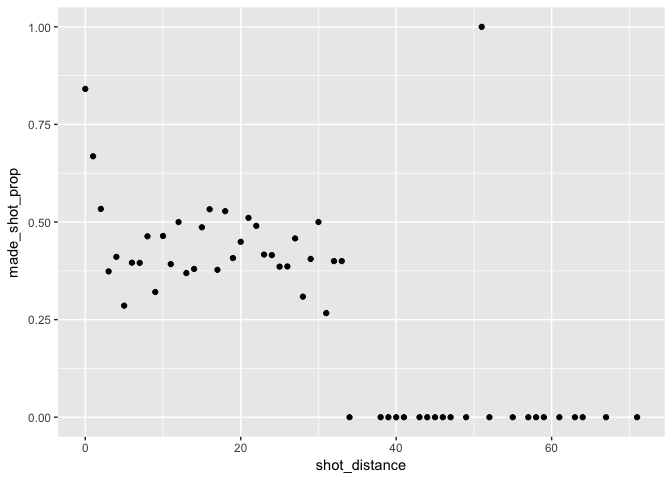
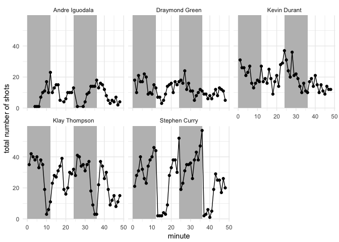

hw02
================
Bartell lin

``` r
library(dplyr)
```

    ## 
    ## Attaching package: 'dplyr'

    ## The following objects are masked from 'package:stats':
    ## 
    ##     filter, lag

    ## The following objects are masked from 'package:base':
    ## 
    ##     intersect, setdiff, setequal, union

``` r
library(ggplot2)
```

``` r
dat <- read.csv("../data/shots-data.csv")
dat %>% 
  group_by(name) %>% 
  summarise(total = n()) %>% 
  arrange(desc(total))
```

    ## # A tibble: 5 x 2
    ##   name           total
    ##   <fct>          <int>
    ## 1 Stephen Curry   1250
    ## 2 Klay Thompson   1220
    ## 3 Kevin Durant     915
    ## 4 Draymond Green   578
    ## 5 Andre Iguodala   371

``` r
effective <- dat 
t <- count(effective, name, total = n(), bool = shot_made_flag == "made shot")
t <- t[t$bool == TRUE, ]
dat %>%
  group_by(name) %>%
  summarise(total = n()) %>%
  mutate("made" = t$n, perc_made = made/total) %>%
  arrange(desc(perc_made))
```

    ## # A tibble: 5 x 4
    ##   name           total  made perc_made
    ##   <fct>          <int> <int>     <dbl>
    ## 1 Kevin Durant     915   495     0.541
    ## 2 Andre Iguodala   371   192     0.518
    ## 3 Klay Thompson   1220   575     0.471
    ## 4 Stephen Curry   1250   584     0.467
    ## 5 Draymond Green   578   245     0.424

``` r
two <- dat[dat$shot_type == "2PT Field Goal", ]
x <- count(two, name, total = n(), bool = shot_made_flag == "made shot")
x <- x[x$bool == TRUE, ]
dat %>%
  group_by(name) %>%
  summarise(total = n()) %>%
  mutate("made" = x$n, perc_made = made/total) %>%
  arrange(desc(perc_made))
```

    ## # A tibble: 5 x 4
    ##   name           total  made perc_made
    ##   <fct>          <int> <int>     <dbl>
    ## 1 Kevin Durant     915   390     0.426
    ## 2 Andre Iguodala   371   134     0.361
    ## 3 Draymond Green   578   171     0.296
    ## 4 Klay Thompson   1220   329     0.270
    ## 5 Stephen Curry   1250   304     0.243

``` r
three <- dat[dat$shot_type == "3PT Field Goal", ]
y <- count(three, name, total = n(), bool = shot_made_flag == "made shot")
y <- y[y$bool == TRUE, ]
dat %>%
  group_by(name) %>%
  summarise(total = n()) %>%
  mutate("made" = y$n, perc_made = made/total) %>%
  arrange(desc(perc_made))
```

    ## # A tibble: 5 x 4
    ##   name           total  made perc_made
    ##   <fct>          <int> <int>     <dbl>
    ## 1 Stephen Curry   1250   280     0.224
    ## 2 Klay Thompson   1220   246     0.202
    ## 3 Andre Iguodala   371    58     0.156
    ## 4 Draymond Green   578    74     0.128
    ## 5 Kevin Durant     915   105     0.115

``` r
whole <- split <- dat %>% group_by(shot_distance) %>% summarise(total = n())
split <- dat %>% group_by(shot_distance, bool = as.numeric(shot_made_flag == "made shot"))
split <- count(split)
split$n[split$bool == 0] <- 0
ag <- aggregate(n ~ shot_distance, data = split, sum)

tbl <- mutate(ag, made_shot_prop = ag[[2]]/whole[[2]]) %>%
  select(c(1,3))
tbl
```

    ##    shot_distance made_shot_prop
    ## 1              0      0.8410758
    ## 2              1      0.6683673
    ## 3              2      0.5335689
    ## 4              3      0.3734940
    ## 5              4      0.4107143
    ## 6              5      0.2857143
    ## 7              6      0.3958333
    ## 8              7      0.3953488
    ## 9              8      0.4634146
    ## 10             9      0.3207547
    ## 11            10      0.4642857
    ## 12            11      0.3921569
    ## 13            12      0.5000000
    ## 14            13      0.3692308
    ## 15            14      0.3797468
    ## 16            15      0.4864865
    ## 17            16      0.5327103
    ## 18            17      0.3775510
    ## 19            18      0.5277778
    ## 20            19      0.4077670
    ## 21            20      0.4492754
    ## 22            21      0.5106383
    ## 23            22      0.4901961
    ## 24            23      0.4166667
    ## 25            24      0.4152047
    ## 26            25      0.3857404
    ## 27            26      0.3861893
    ## 28            27      0.4580153
    ## 29            28      0.3088235
    ## 30            29      0.4054054
    ## 31            30      0.5000000
    ## 32            31      0.2666667
    ## 33            32      0.4000000
    ## 34            33      0.4000000
    ## 35            34      0.0000000
    ## 36            38      0.0000000
    ## 37            39      0.0000000
    ## 38            40      0.0000000
    ## 39            41      0.0000000
    ## 40            43      0.0000000
    ## 41            44      0.0000000
    ## 42            45      0.0000000
    ## 43            46      0.0000000
    ## 44            47      0.0000000
    ## 45            49      0.0000000
    ## 46            51      1.0000000
    ## 47            52      0.0000000
    ## 48            55      0.0000000
    ## 49            57      0.0000000
    ## 50            58      0.0000000
    ## 51            59      0.0000000
    ## 52            61      0.0000000
    ## 53            63      0.0000000
    ## 54            64      0.0000000
    ## 55            67      0.0000000
    ## 56            71      0.0000000

``` r
ggplot(tbl, aes(x = shot_distance, y = made_shot_prop)) + geom_point()
```



I can see that the shorter the distance, the higher the percentage that the shot makes it in. After about 35 feet, the chances of getting the ball in are basically null. There is however, one outlier. Distances of 1, 2, and 3 feet have percentages over 50%. There are a couple around 20 feet that make the threshold as well.

``` r
gdat <- dat %>%
  group_by(minute, name) %>%
  count(minute, name)


ggplot(gdat, aes(x= minute, y= n)) + geom_rect(xmin = 0, xmax= 12, ymin = 0, ymax= 100, fill = "grey") + geom_rect(xmin = 24, xmax= 36, ymin = 0, ymax= 100, fill = "grey") + geom_point() + geom_path() + facet_wrap(~name) + theme_minimal() + scale_x_continuous(limits = c(0, 48)) + ylab("total number of shots")
```


