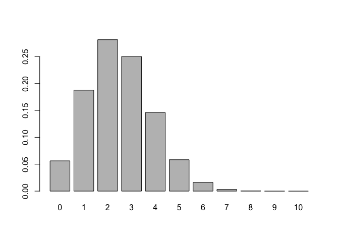
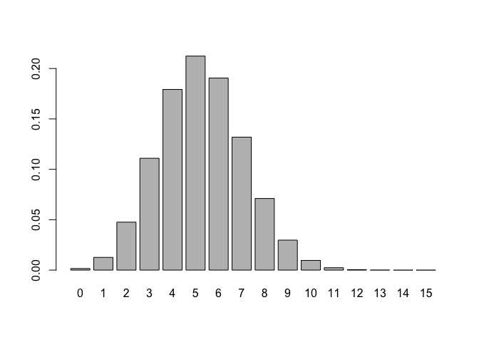

hw3
================
Bartell Lin

``` r
dat <- read.csv("nba2017-roster.csv")
```

``` bash
cut -d "," -f 2 nba2017-roster.csv | sort -u > team-names.txt
head -n 5 team-names.txt
```

    ## "ATL"
    ## "BOS"
    ## "BRK"
    ## "CHI"
    ## "CHO"

``` bash
cut -d "," -f 3 nba2017-roster.csv | sort -u > position-names.txt
head -n 5 position-names.txt
```

    ## "C"
    ## "PF"
    ## "PG"
    ## "SF"
    ## "SG"

``` bash
cut -d "," -f 7 nba2017-roster.csv | tail +2 | sort -n | uniq -c > experience-counts.txt
head -n 5 experience-counts.txt
```

    ##   80 0
    ##   52 1
    ##   46 2
    ##   36 3
    ##   35 4

``` bash
grep "team" nba2017-roster.csv > temp.csv
grep "LAC" nba2017-roster.csv > t.csv
cat temp.csv t.csv > LAC.csv
cat LAC.csv
```

    ## "player","team","position","height","weight","age","experience","salary"
    ## "Alan Anderson","LAC","SF",78,220,34,7,1315448
    ## "Austin Rivers","LAC","SG",76,200,24,4,1.1e+07
    ## "Blake Griffin","LAC","PF",82,251,27,6,20140838
    ## "Brandon Bass","LAC","PF",80,250,31,11,1551659
    ## "Brice Johnson","LAC","PF",82,230,22,0,1273920
    ## "Chris Paul","LAC","PG",72,175,31,11,22868828
    ## "DeAndre Jordan","LAC","C",83,265,28,8,21165675
    ## "Diamond Stone","LAC","C",83,255,19,0,543471
    ## "J.J. Redick","LAC","SG",76,190,32,10,7377500
    ## "Jamal Crawford","LAC","SG",77,200,36,16,13253012
    ## "Luc Mbah a Moute","LAC","SF",80,230,30,8,2203000
    ## "Marreese Speights","LAC","C",82,255,29,8,1403611
    ## "Paul Pierce","LAC","SF",79,235,39,18,3500000
    ## "Raymond Felton","LAC","PG",73,205,32,11,1551659
    ## "Wesley Johnson","LAC","SF",79,215,29,6,5628000

``` bash
grep "LAL" nba2017-roster.csv| cut -d "," -f 6 | sort -n | uniq -c 
```

    ##    2 19
    ##    1 20
    ##    2 22
    ##    3 24
    ##    2 25
    ##    2 30
    ##    2 31
    ##    1 37

``` bash
grep "CLE" nba2017-roster.csv| cut -d "," -f 2 | uniq -c
```

    ##   15 "CLE"

``` bash
grep "position" nba2017-roster.csv| cut -d "," -f 1,4,5 > temp.csv
grep "GSW" nba2017-roster.csv| cut -d "," -f 1,4,5 > t.csv
cat temp.csv t.csv > gsw-height-weight.csv
cat gsw-height-weight.csv
```

    ## "player","height","weight"
    ## "Andre Iguodala",78,215
    ## "Damian Jones",84,245
    ## "David West",81,250
    ## "Draymond Green",79,230
    ## "Ian Clark",75,175
    ## "James Michael McAdoo",81,230
    ## "JaVale McGee",84,270
    ## "Kevin Durant",81,240
    ## "Kevon Looney",81,220
    ## "Klay Thompson",79,215
    ## "Matt Barnes",79,226
    ## "Patrick McCaw",79,185
    ## "Shaun Livingston",79,192
    ## "Stephen Curry",75,190
    ## "Zaza Pachulia",83,270

``` bash
cut -d "," -f 1,8 nba2017-roster.csv | sort -t "," -k 2 -n -r | head -n 10 > top10-salaries.csv
cat top10-salaries.csv
```

    ## "LeBron James",30963450
    ## "Russell Westbrook",26540100
    ## "Mike Conley",26540100
    ## "Kevin Durant",26540100
    ## "James Harden",26540100
    ## "DeMar DeRozan",26540100
    ## "Al Horford",26540100
    ## "Carmelo Anthony",24559380
    ## "Damian Lillard",24328425
    ## "Dwyane Wade",23200000

``` r
source("code/binomial-functions.R")
```

``` r
bin_probability(10, 3, 1/6)
```

    ## [1] 0.1550454

``` r
df1 <- bin_distribution(10, .25)
df1
```

    ##    success  probability
    ## 1        0 5.631351e-02
    ## 2        1 1.877117e-01
    ## 3        2 2.815676e-01
    ## 4        3 2.502823e-01
    ## 5        4 1.459980e-01
    ## 6        5 5.839920e-02
    ## 7        6 1.622200e-02
    ## 8        7 3.089905e-03
    ## 9        8 3.862381e-04
    ## 10       9 2.861023e-05
    ## 11      10 9.536743e-07

``` r
barplot(df1[[2]], names.arg = df1[[1]])
```



``` r
prob <- 0
for (i in 4:5) {
  prob <- prob + bin_probability(5, i, .35) 
}
prob
```

    ## [1] 0.0540225

``` r
df2 <- bin_distribution(15, .35)
df2
```

    ##    success  probability
    ## 1        0 1.562069e-03
    ## 2        1 1.261672e-02
    ## 3        2 4.755531e-02
    ## 4        3 1.109624e-01
    ## 5        4 1.792469e-01
    ## 6        5 2.123387e-01
    ## 7        6 1.905604e-01
    ## 8        7 1.319264e-01
    ## 9        8 7.103729e-02
    ## 10       9 2.975066e-02
    ## 11      10 9.611752e-03
    ## 12      11 2.352527e-03
    ## 13      12 4.222484e-04
    ## 14      13 5.246873e-05
    ## 15      14 4.036056e-06
    ## 16      15 1.448841e-07

``` r
barplot(df2[[2]], names.arg = df2[[1]])
```


